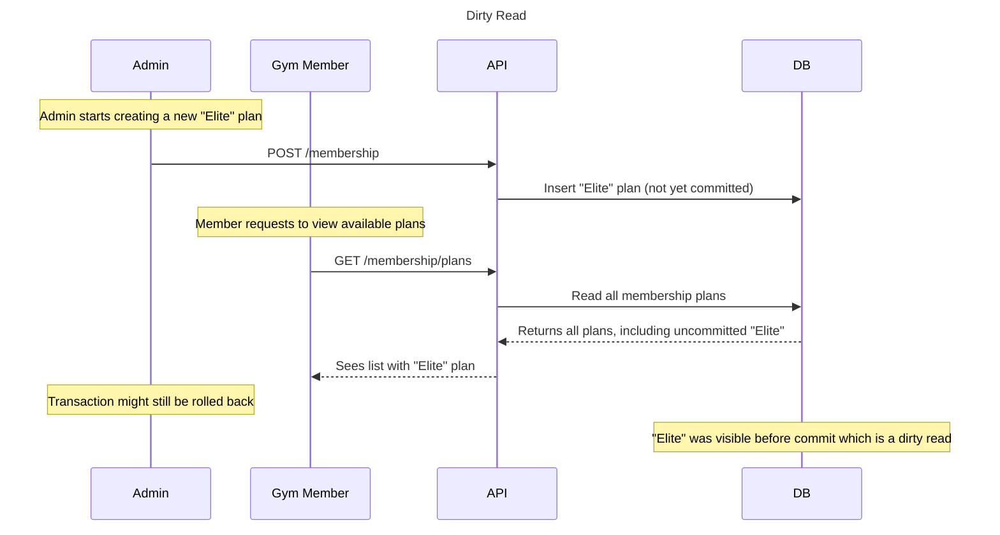
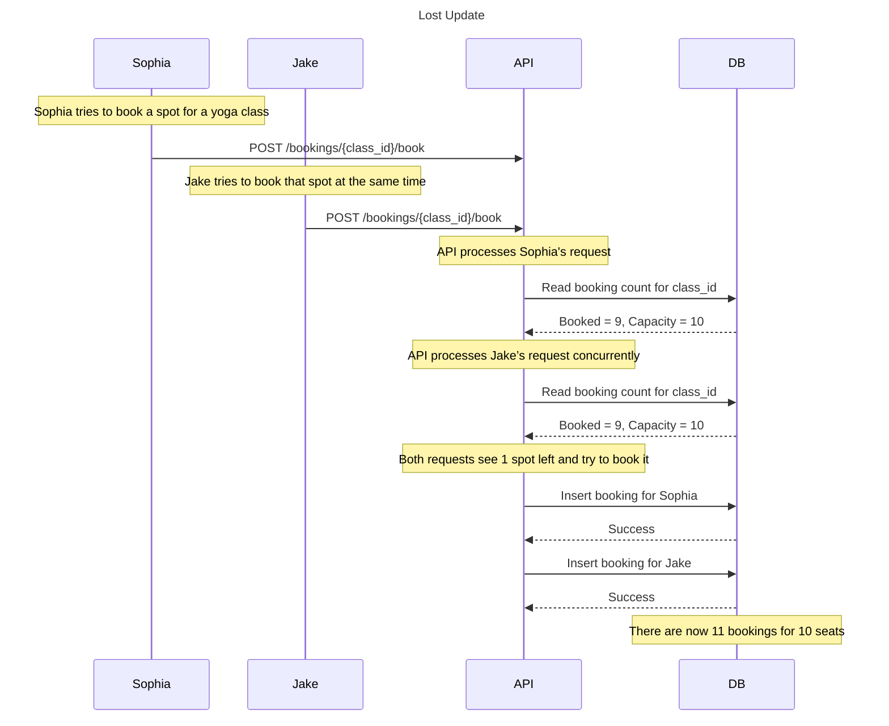

# Case 1: Dirty Read

A gym admin is in the process of creating a new membership plan called "Elite", but the transaction hasn't committed yet. At the same time, a new gym member sends a request to see all membership plans. Since the new plan is written to the database but not committed, it still shows up in the read, which is a dirty read. This is because the uncommitted plan might be rolled back later.

## Sequence Diagram

## Solution

To prevent the dirty read problem where a user might see a membership plan that hasn’t been committed yet, our API can use the READ COMMITTED isolation level. This means:

While POST /membership transaction is still in progress (uncommitted), a simultaneous GET /membership/plans request from another user will not see the uncommitted plan.
If the admin's transaction is rolled back, the inserted plan is not visible to the gym member.
Only if the transaction is committed successfully will future GET requests include the new plan.

This isolation level prevents users from viewing in-progress or potentially rolled-back changes to the membership plans.

# Case 2: Lost Update

Two gym users, Sophia and Jake, both try to book the last available seat for a Yoga Class at the gym. Both see the same seat as available and proceed to book it simultaneously. Their booking updates overwrite each other, causing both to believe they secured the same seat. However, only one seat was available.

## Sequence Diagram

## Solution

To prevent the lost update problem where two users can book the last seat simultaneously, our API can utilize Optimistic Concurrency Control, where each class booking record includes a row version/timestamp that tracks changes. So, when Sophia or Jake attempts to book the class:

- The current booking count and version number are read.
- The expected version is compared against the actual version at the time of booking.
- If the version has changed (which means another booking happened concurrently), the transaction is rolled back and retried, which ensures that only one user can secure the final spot.
- If no conflict is found, the booking gets committed, and the class version is incremented.

This allows only one booking for the last spot, preventing overbooking.
